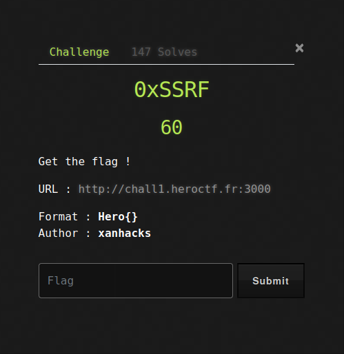
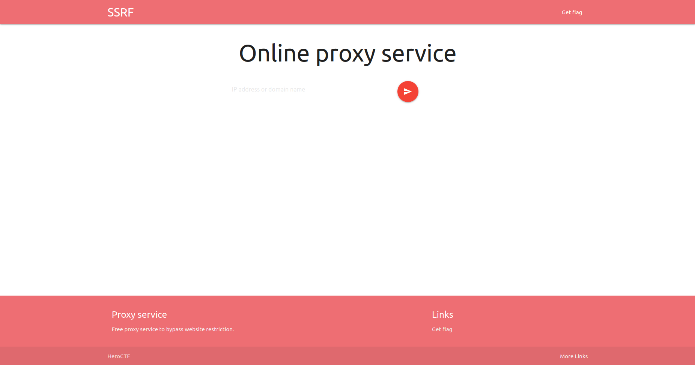
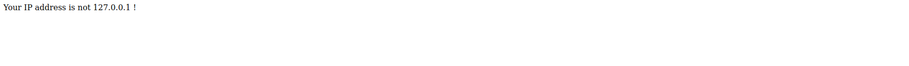
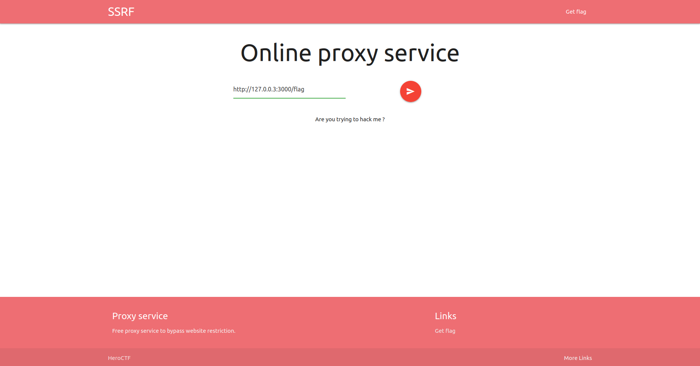
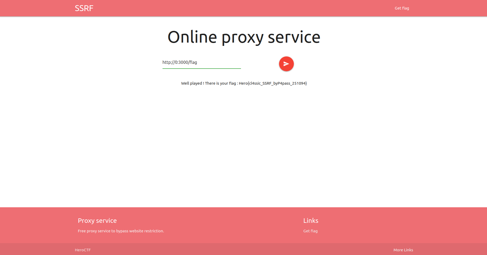

# HeroCTF v3

## 0xSSRF
 
 

 
 

Going into this challenge we had the following page:

So from what we have is a proxy website allows us to fecth data from another website from it.
We also see that there is as link called "Get Flag" which unfortunatly returns:

So from what we can see we can only access the "Get Flag" from the localhost which is a problem.
We try to put the link via the proxy service which returns:

After some attemps to check different ways of using localhost ip we get to http://0:3000/flag which gives us the flag Hero{cl4ssic_SSRF_byP4pass_251094}

