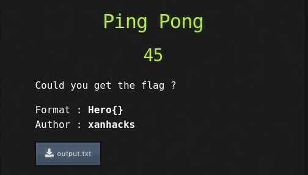

# HeroCTF v3

## Ping Pong
 
 

 
 

The provided txt file simply contained the words "PING" and "PONG", one per line, repeated.

Since no other clues or information were provided, we could only assume that each line would represent a binary number (PONG -> 0 and PING -> 1).

Converting each line to its corresponding bit gives us the following string of bits:

>01001000011001010111001001101111011110110111000000110001011011100011011001011111011100000011000001101110001101100101111100110001001101010101111101100110011101010110111001111101

Which when translated to ASCII characters gives us the flag:

>Hero{p1n6_p0n6_15_fun}

