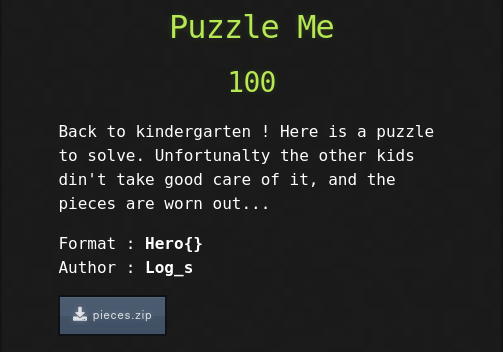
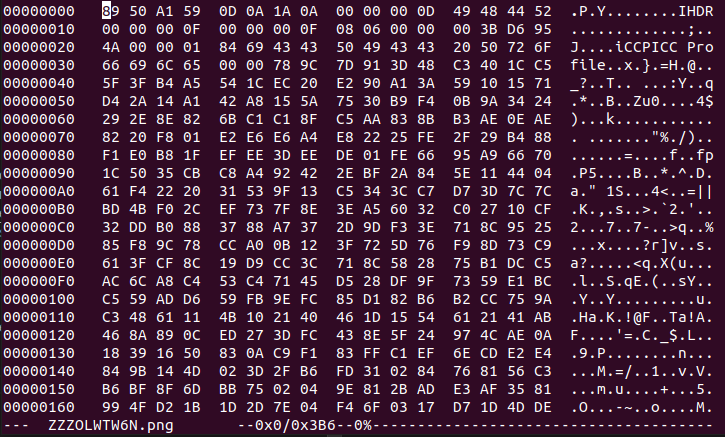
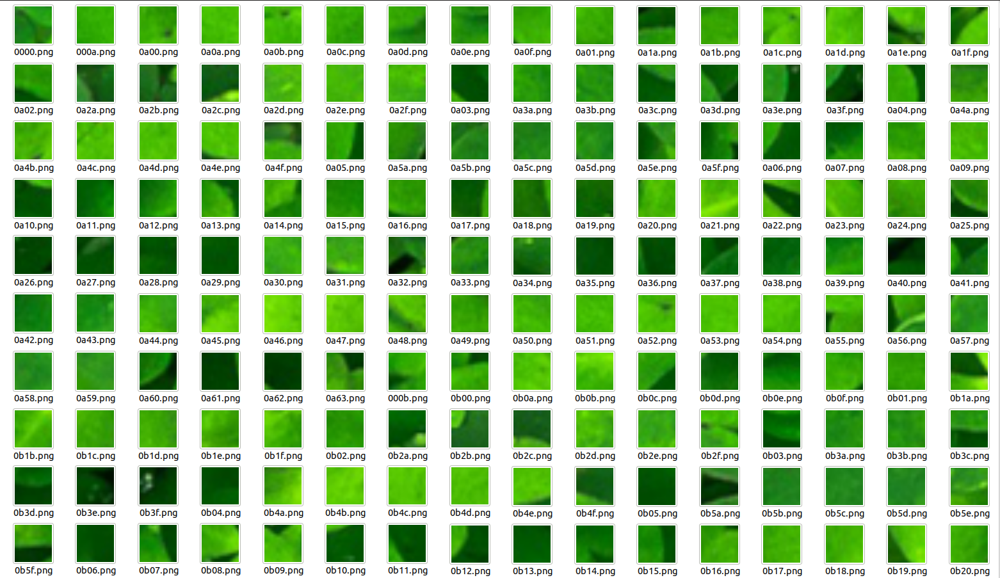

# HeroCTF v3

## Puzzle Me
<br/>
<br/>



<br/>
<br/>

Extracting the pieces.zip file gives us 20000 corrupted PNG files... ooh boy...

I started by reading a bit more about how a PNG file is structured (the libpng website really helped out on this, you can check it out [here](http://www.libpng.org/pub/png/spec/1.2/PNG-Structure.html) to learn more). A PNG file must always start with these bytes to be recognized as valid, which are called the file signature:

> 89 50 4E 47  0D 0A 1A 0A

Checking a few random files with a hex editor, we can see that the signature is corrupted

<br/>



<br/>

So we need to fix that. I ran a simple python script that recreated these images, but with the correct signature:

```
mypath = "images"
outputPath = "output"

def fixImage(filename):

    header = [137, 80, 78, 71, 13, 10, 26, 10]
    headerBinary = bytearray(header) 

    inputFile = open(mypath + "/" + filename, 'r+b')

    inputFileBytes = bytearray(inputFile.read())

    headerBinary.extend(inputFileBytes[len(header):])

    outputFile = open(outputPath + "/" + filename, 'w+b')

    outputFile.write(headerBinary)
    outputFile.close()
    inputFile.close()

from os import listdir
from os.path import isfile, join
onlyfiles = [f for f in listdir(mypath) if isfile(join(mypath, f))]

for filename in onlyfiles:
    fixImage(filename)

```

This produced 20000 PNG images, all 15X15 pixels. Now all that is left to do is to piece them together somehow.

After spending a lot of time looking at the name of each file, I saw that some of the pictures had a white shape. I was guessing that that was the flag, but it still didn't help me on how to piece together all these images.

After a lot of time, I noticed that the original corrupted PNG files contained a clue. The 3rd and 4th bytes were different across files... interesting. Running the same script again, but naming the output images with the hex values of those bytes revealed that those were in fact the coordinates for where that piece should be on the final image. The first byte represents the x coordinate and the second byte the y coordinate.

<br/>

```
mypath = "images"
outputPath = "output"

def fixImage(filename):

    header = [137, 80, 78, 71, 13, 10, 26, 10]
    headerBinary = bytearray(header) 

    inputFile = open(mypath + "/" + filename, 'r+b')

    inputFileBytes = bytearray(inputFile.read())

    headerBinary.extend(inputFileBytes[len(header):])

    newfileName = inputFileBytes[2:4] #PNG magic numbers
    outputFile = open(outputPath + "/" + newfileName.hex() + ".png", 'w+b')

    outputFile.write(headerBinary)
    outputFile.close()
    inputFile.close()

from os import listdir
from os.path import isfile, join
onlyfiles = [f for f in listdir(mypath) if isfile(join(mypath, f))]

for filename in onlyfiles:
    fixImage(filename, outputPath + "/" + filename)
```

<br/>
<br/>



<br/>
<br/>

Almost there. All we have to know is the dimensions of the final image and then piece everything together. Since the first picture alphabetically is **0000.png** and the last one is **c763.png** , we can infer that the image is 2985x1485.

Great, we now have all the information we need to build the image. Using the PIL library, this is extremely easy to do.

<br/>

```
import sys
from PIL import Image
from os import listdir
from os.path import isfile, join
from shutil import copyfile

mypath = "output"

allImages = [f for f in listdir(mypath) if isfile(join(mypath, f))]

new_im = Image.new('RGB', (2985, 1485))

x_offset = 0

for im in allImages:
    imageFile = Image.open("output/" + im)

    # Multiply by 15 since each image is 15x15

    xPos = int("0x" + im[0:2], 0) * 15 
    yPos = int("0x" + im[2:4], 0) * 15

    new_im.paste(imageFile, (xPos, yPos))

new_im.save('flag.png')  
```
<br/>

Running this will generate the complete image with the flag


<br/>


>Hero{PuZzzZZzzzZzzzzL3}