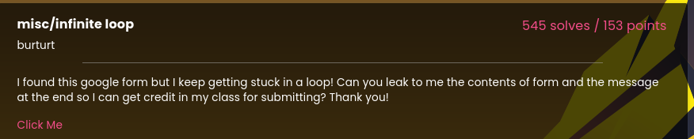
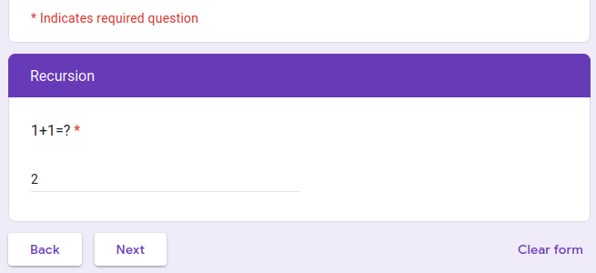
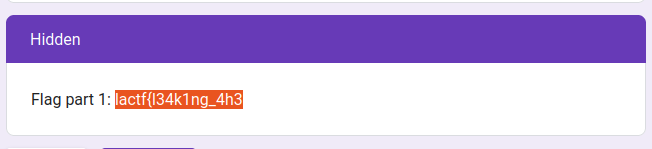
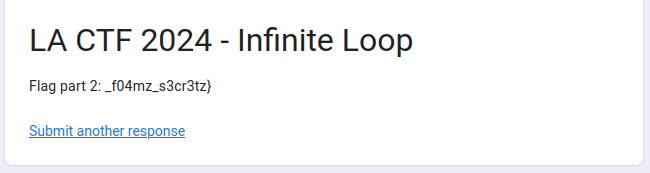

# LA CTF 2024

## Infinite Loop

<br/>



<br/>

For this challenge we have a Google Forms link. After the first page, we get to a page that redirects to itself when answered.

<br/>



<br/>

We are getting nowhere like this, so we can check the page source code, Most of it is irrelevant, but one hidden input is very interesting:

```html
<input type="hidden" name="pageHistory" value="0,1,1,1">
```

Seems like Google Forms stores the user's page history in a hidden input element. Our goal is to get out of the infinite loop, so I will modifyA this history like this:

```html
<input type="hidden" name="pageHistory" value="0,1,2,1">
```

If I press back on the form, it should redirect me to page 2 of the form. And as such half of the flag is revealed. Clicking Submit reveals the rest of the flag.

<br/>



<br/>



<br/>

Flag: **lactf{l34k1ng_4h3_f04mz_s3cr3tz}**
