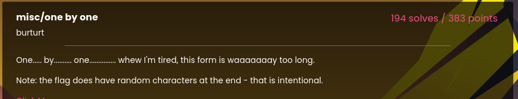
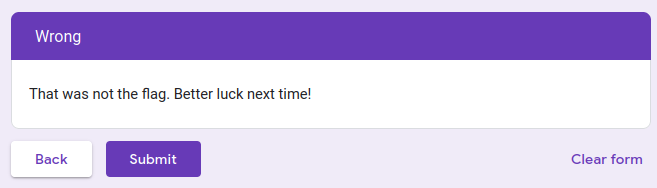
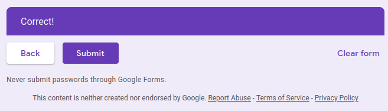

# LA CTF 2024

## One by One

<br/>



<br/>


We have yet another google form task. The goal of this one seems to input the flag one character at a time. Selecting random characters until the end greets us this screen:

<br/>



<br/>

Using the same logic as the infinite loop task, we try to edit the hidden input with the page history. I will put my previous page as 62, assuming that is the final page that shows up when the flag is correct:

<br/>



<br/>

Well, seems like we were right, but they don't print the flag, they just say that the input was correct... so we need to find a way to figure out what the flag is. We know that the flag starts with "lactf{", so we start putting those characters in the form, and after a random letter. Looking at the history again we see something interesting:

```html
<input type="hidden" name="pageHistory" value="0,2,4,6,8,10,12,14,15,17">
```

It seems like the page number is even when the answer is correct until that point. After an incorrect character, all pages become odd. There is the pattern we are looking for. Knowing this information, we can bruteforce the flag. The idea is to check each character and move to the next page in the form. If the last number of the pageHistory is odd, then it's a wrong character. If it's even, it's correct.

For this I used Puppeteer to simulate user clicks. The code can be found in the **scraper.js** file.

Running this takes a while and took quite some tries, as sometimes, probably due to my machine, the clicks failed. But either way, we got to the end with the flag being printed on the screen.

Flag: **lactf{1_by_0n3_by3_un0_,"g1'}**